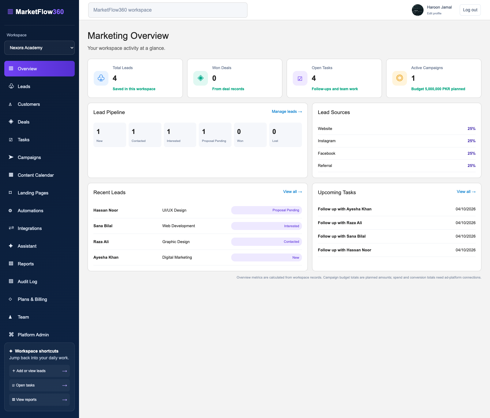
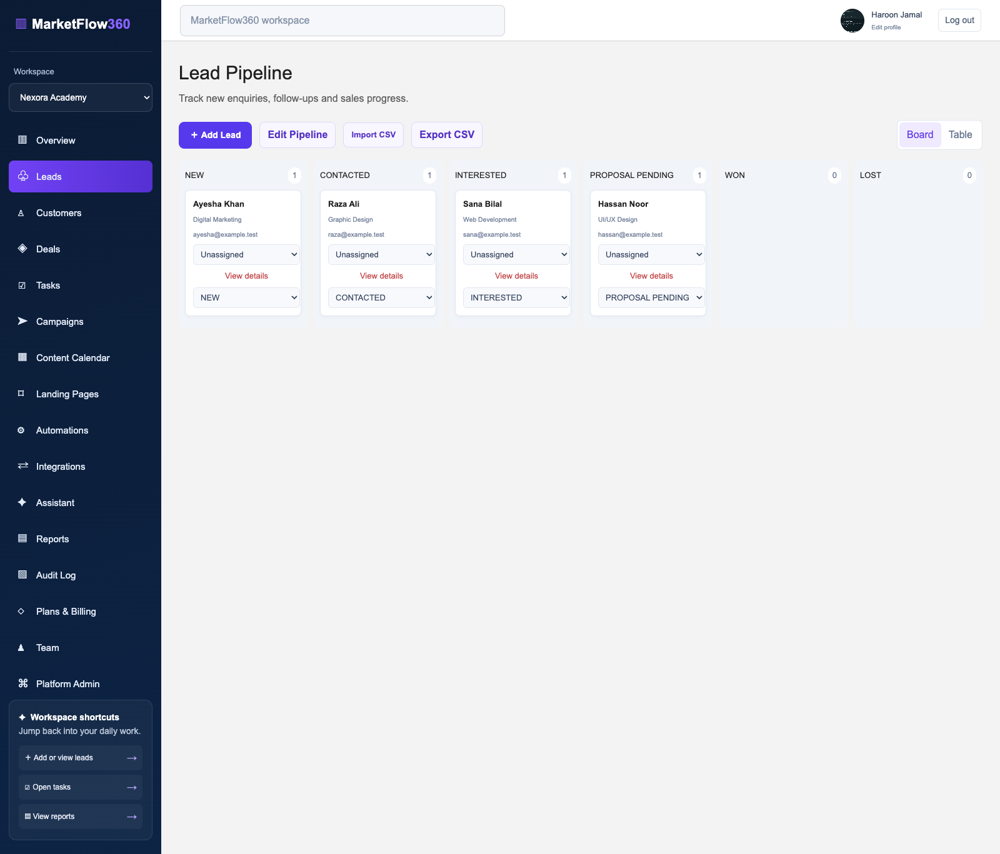
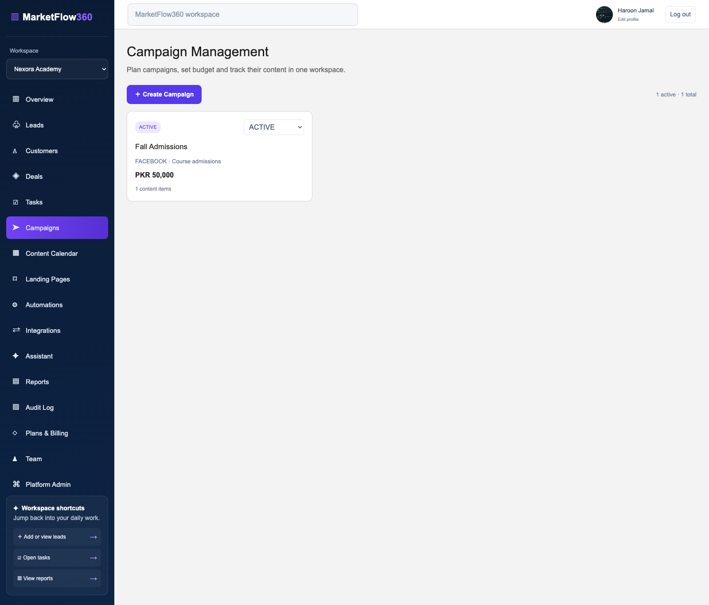
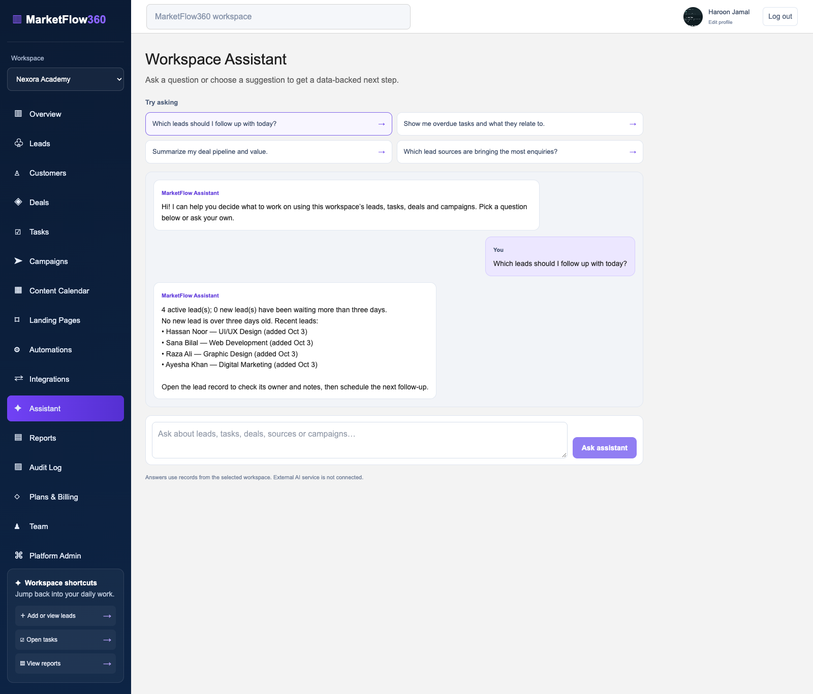
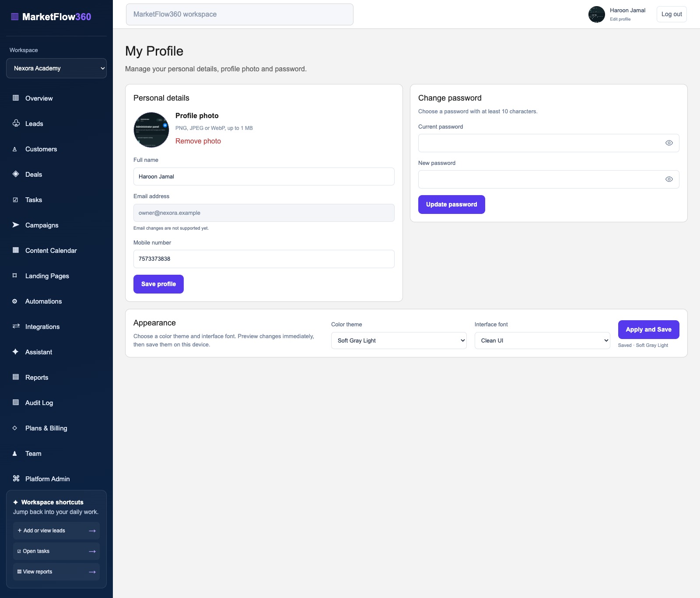
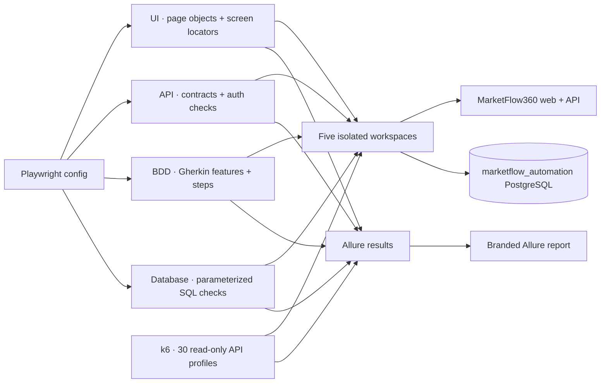
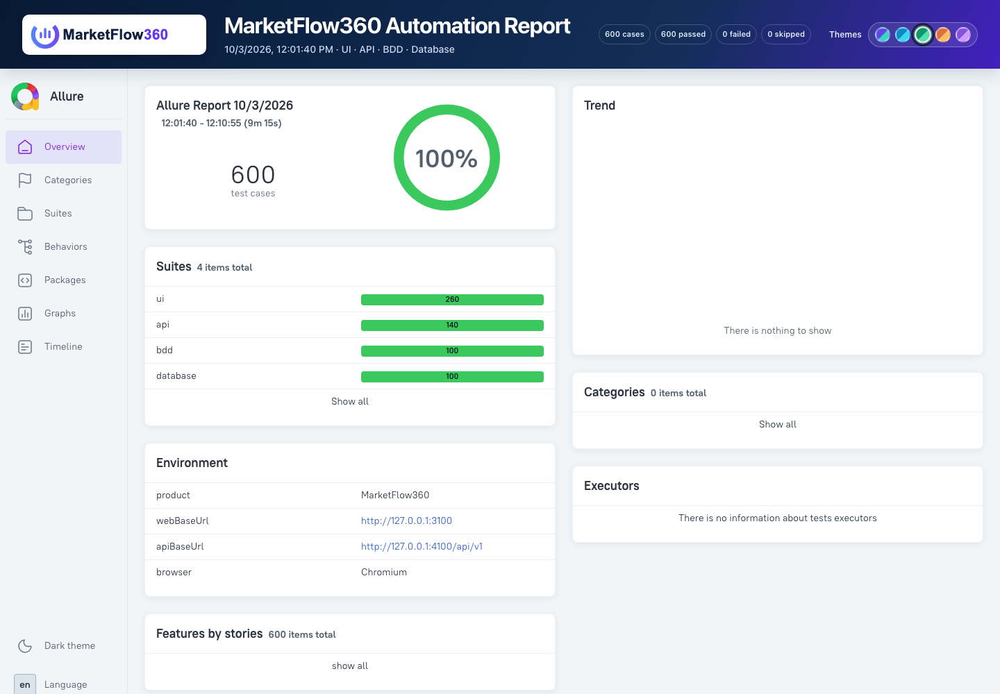
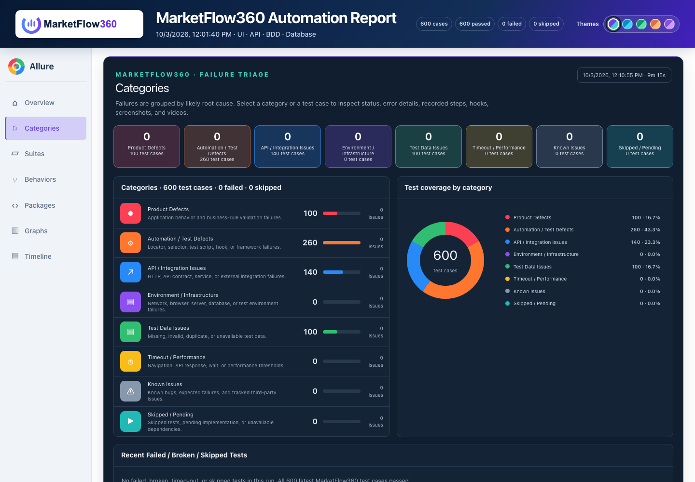
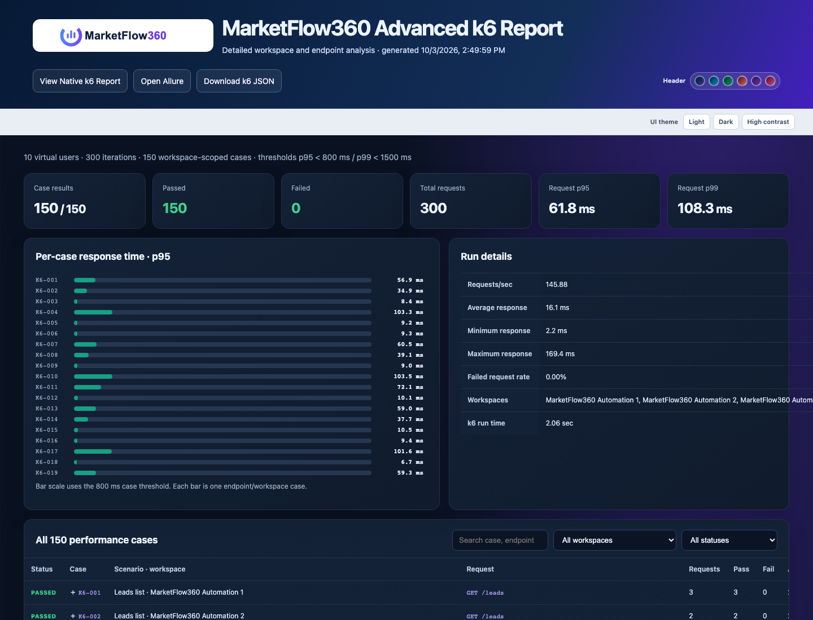
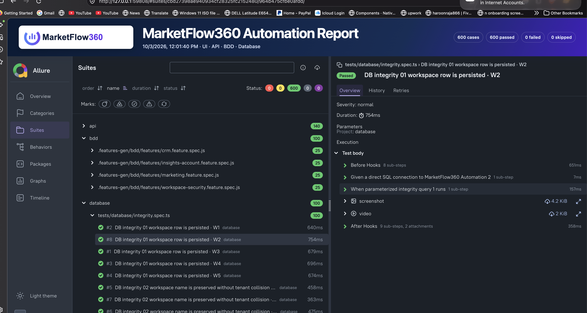

<p align="center">
  
</p>

<h1 align="center">Marketing, CRM & Business Digitalization</h1>

<p align="center">
  A multi-workspace CRM and marketing toolkit for small businesses, academies, retailers, service teams and agencies.
</p>

<p align="center">
  <a href="#product-screens">Screenshots</a> ·
  <a href="#get-started">Get started</a> ·
  <a href="#automation">Automation</a> ·
  <a href="docs/PHASES.md">Delivery phases</a> ·
  <a href="docs/ARCHITECTURE.md">Architecture</a>
</p>

---

## Product overview

MarketFlow360 brings enquiries, sales follow-ups and marketing work into one workspace. Teams can capture a lead, move it through a configurable pipeline, convert it to a customer and deal, and keep the next action visible as a task. Campaign, content, landing-page and reporting screens use the same workspace data.

The repository is a **local-ready MVP** built as a small-team modular monolith. It is not a production SaaS deployment: payment processing, third-party social publishing, provider OAuth and production operations need further integrations and deployment work.

## Product screens

These current screenshots were captured from the local application with its fictional demo data.

| Workspace overview | Lead pipeline |
|---|---|
|  |  |

| Campaign management | Workspace assistant |
|---|---|
|  |  |

| Account profile and appearance settings |
|---|
|  |

Screenshots live in [`docs/screenshots`](docs/screenshots). Refresh them after a major UI change and keep them based on fictional/local data.

## What is implemented

### CRM and workspace operations

- Multiple workspaces per account, workspace creation/switching, agency-to-client grants and server-validated tenant access.
- Leads board/table, custom stages, assignment, activity, duplicate checks, CSV import/export, bulk stage updates and lead conversion.
- Customer and deal records, team tasks, comments, calendar, due reminders and record attachments.
- Team invitations, workspace roles and access controls.
- Personal profile with editable name, phone, profile photo and password. Sign-in/sign-up password visibility controls and country calling code at registration.

### Marketing and automation

- Campaign planning with channel, status, budget, dates and goals. Budgets are planned values; ad-platform spend and performance are not synced.
- Content calendar with drafts, review and publish-state tracking. Status changes do not publish externally.
- Public enquiry pages with configurable text questions and lead capture into the owning workspace.
- Lead-triggered automations with a source or stage condition, one action, optional delay up to seven days, run history and up to three attempts. Delayed work is polled by an API worker.
- Inbound webhook integration for creating workspace leads.

### Insights and settings

- Workspace overview, date-filtered reports, lead trends, CSV export, audit events and database health endpoints.
- Workspace assistant with suggested questions and responses grounded in the selected workspace's leads, tasks, deals, sources and campaigns. It uses local rules and database records; no external generative AI service is connected.
- Plan catalog, optional external billing-portal link and an allowlisted platform-admin overview. There is no checkout or payment collection.
- Appearance settings with light, dark and high-contrast themes and selectable UI font stacks. Preferences are saved in the browser.
- MarketFlow360 favicon for the browser tab.

## Technology and layout

| Area | Implementation |
|---|---|
| Web | Next.js App Router, React, TypeScript and responsive CSS |
| API | NestJS REST API, DTO validation and workspace guards |
| Data | PostgreSQL, Prisma schema, migrations and demo seed |
| Repository | pnpm workspace with separate `apps/web` and `apps/api` packages |
| Local services | Docker Compose PostgreSQL and Redis; Redis is provisioned but not currently used by the app |
| CI | GitHub Actions for migrations, TypeScript checks, production builds and API integration tests |
| Quality automation | Playwright UI/API/BDD/database suites, Grafana k6 API performance cases and branded Allure reports; see [Automation](automation/README.md) |

```text
Browser → Next.js web app → NestJS /api/v1 → Prisma → PostgreSQL
                                      ├── CRM and workspace APIs
                                      ├── Campaign, content and landing-page APIs
                                      ├── Reports and workspace assistant
                                      └── Automation/reminder polling workers
```

## Get started

### Requirements

- Node.js 24
- Corepack with pnpm 10.17.1
- Docker Compose **or** a local PostgreSQL 17 server

### Docker Compose setup

From the repository root:

```sh
docker compose -f infra/docker-compose.yml up -d
corepack pnpm install
cp apps/api/.env.example apps/api/.env
```

Then initialize the database and start the apps:

```sh
corepack pnpm --filter @marketflow/api db:generate
corepack pnpm --filter @marketflow/api db:migrate
corepack pnpm --filter @marketflow/api db:seed
corepack pnpm dev
```

Open the web app at <http://localhost:3000>. The API is at <http://localhost:4000/api/v1>; database readiness is <http://localhost:4000/api/v1/health/ready>.

### Existing local PostgreSQL

Create a local database named `marketflow`, copy `apps/api/.env.example` to `apps/api/.env`, and set `DATABASE_URL` to:

```text
postgresql://YOUR_LOCAL_POSTGRES_USER@localhost:5432/marketflow?schema=public
```

Run the database-generation, migration and seed commands above. `apps/api/.env` is ignored by Git and must not be committed.

### Demo accounts

The seed creates five fictional local accounts, 20 company workspaces and two team memberships per workspace. All five accounts use the local-only password `MarketFlow2026!`.

| User | Email |
|---|---|
| Haroon Jamal | `owner@nexora.example` |
| Amina Shah | `owner@urbanretail.example` |
| Adil Agency | `owner@brightagency.example` |
| Sana Qureshi | `sana@northstar.example` |
| Bilal Ahmed | `bilal@pixelcraft.example` |

Profile portraits are stored under [`apps/web/public/demo-avatars/`](apps/web/public/demo-avatars/) and assigned to each seeded user. See [`docs/DEMO-DATA-README.md`](docs/DEMO-DATA-README.md) for the company list, workspace membership, setup details and demo-data notes. These credentials are only for the local demo. Seeding refuses to run in production or against a non-local database host.

## Configuration

API variables are documented in [`apps/api/.env.example`](apps/api/.env.example).

| Variable | Purpose |
|---|---|
| `DATABASE_URL` | PostgreSQL connection string |
| `WEB_ORIGIN` | Web origin for CORS and generated verification/reset links |
| `SESSION_SECRET` | Local session/security secret; replace the example before any shared deployment |
| `RESEND_API_KEY`, `EMAIL_FROM` | Optional delivery for verification, reset, invitation and task reminder email |
| `PLATFORM_ADMIN_EMAILS` | Comma-separated allowlist for platform-admin access |
| `BILLING_PORTAL_URL` | Optional link to an externally hosted billing portal |
| `PORT` | API port; defaults to `4000` |

The web app uses `NEXT_PUBLIC_API_URL`, defaulting to `http://localhost:4000/api/v1`.

Without Resend credentials, authentication routes return demo links for local use and reminder emails cannot be delivered. A billing URL is only a link: it does not configure payments or change subscription plans.

## Useful commands

```sh
corepack pnpm dev                         # Run web and API in watch mode
corepack pnpm typecheck                   # Type-check all packages
corepack pnpm build                       # Production builds
corepack pnpm test                        # API integration suite; requires marketflow_test
corepack pnpm --filter @marketflow/api db:generate
corepack pnpm --filter @marketflow/api db:migrate
corepack pnpm --filter @marketflow/api db:deploy
corepack pnpm --filter @marketflow/api db:seed
```

### Integration tests

Use a separate database named `marketflow_test`; the test script refuses any other database name:

```sh
createdb marketflow_test
DATABASE_URL='postgresql://YOUR_LOCAL_POSTGRES_USER@localhost:5432/marketflow_test?schema=public' corepack pnpm --filter @marketflow/api db:deploy
DATABASE_URL='postgresql://YOUR_LOCAL_POSTGRES_USER@localhost:5432/marketflow_test?schema=public' corepack pnpm test
```

The API integration suite covers authentication, tenant isolation, dynamic pipeline stages, landing-page form questions, scheduled automations, webhook capture, reports, audit events and shared rate limits. It removes its test workspace and user when it finishes.

## Repository map

```text
apps/
  api/                 NestJS modules, Prisma schema, migrations, seed and API integration suite
  web/                 Next.js routes, feature screens, styles, logo and favicon
docs/
  ARCHITECTURE.md      Runtime shape, tenancy and security notes
  PHASES.md            Delivery scope, phase status, limitations and effort estimate
  screenshots/         Current local product screenshots used in this README
infra/                 Local PostgreSQL and Redis Compose configuration
.github/workflows/     CI pipeline
```

## Seven-developer work split

The feature boundaries support parallel work without splitting the application into microservices.

| Developer | Primary area | Main files |
|---|---|---|
| 1 | App shell, navigation and shared visual system | `apps/web/app/workspace-shell.tsx`, `apps/web/app/screens.css` |
| 2 | Authentication, account profile and team access | `apps/web/app/login`, `apps/web/app/register`, `apps/web/app/profile`, `apps/api/src/auth.ts` |
| 3 | Lead CRM and pipeline | `apps/web/app/screens/leads-screen.tsx`, `apps/api/src/features/leads.controller.ts` |
| 4 | Customers and deals | `apps/web/app/screens/customers-screen.tsx`, `apps/web/app/screens/deals-screen.tsx`, API feature controllers |
| 5 | Tasks and reminders | `apps/web/app/screens/tasks-screen.tsx`, `apps/api/src/features/tasks.controller.ts` |
| 6 | Database, migrations and API foundation | `apps/api/prisma`, `apps/api/src/prisma.service.ts` |
| 7 | Marketing, reports, integration and release docs | `apps/web/app/screens/marketing-screen.tsx`, `apps/api/src/features`, `docs/`, `.github/` |

Coordinate Prisma schema changes before editing `schema.prisma`; add a migration and regenerate Prisma Client after changes.

## Known limitations

- Social/ad OAuth, message sending, ad metrics and content publishing need provider-specific integrations.
- Automations support one condition and one action. The delayed-run worker is in-process; run one API instance until worker claiming moves to shared queue infrastructure.
- The assistant uses deterministic rules over the selected workspace data. Connect a model provider to add natural-language generation.
- Attachments are stored in PostgreSQL, capped at 3 MB, and do not have malware scanning or external object storage.
- Billing is informational. There is no payment collection, invoice handling or plan enforcement.
- Public forms and webhook endpoints have database-backed rate limits, but no CAPTCHA or edge/WAF integration.
- Backups, monitoring, deployment automation and production hosting are outside the local MVP scope.

See [the phased checklist](docs/PHASES.md) for implementation status and remaining work, and [the architecture notes](docs/ARCHITECTURE.md) for tenancy, security and runtime details.

## Automation

MarketFlow360 includes a separate automation package in [`automation/`](automation/README.md): four Playwright projects plus k6 performance coverage. The defined suite contains **750 cases** across five isolated workspaces. The [automation guide](automation/README.md) documents setup, commands, test data isolation, Allure evidence, k6 thresholds and report generation.

| Test project | Cases | What it exercises |
|---|---:|---|
| UI | 260 | Per-screen smoke coverage, invalid form input, navigation, saved appearance and responsive regression checks |
| API | 140 | Authentication and workspace guards, request validation, contracts and tenant-scoped resources |
| BDD | 100 | Gherkin user journeys using 20 feature scenarios across five workspaces |
| Database | 100 | Parameterized SQL integrity and tenant-boundary checks across five workspaces |
| k6 Performance | 150 | 30 read-only API request profiles across five workspaces, with latency and response checks |
| **Total** | **750** | Every case has an individual result; k6 cases include request/latency evidence |

### Automation architecture

The Playwright config starts the web and API on automation-only ports. Its four projects share hooks and seeded test accounts while keeping UI page objects, API clients, BDD scenarios and database checks in separate modules. k6 runs independently against the API using the same five workspace fixtures. The database preparer targets the isolated `marketflow_automation` database; Playwright global setup provisions the workspace fixtures.



k6 cases keep per-workspace request counts, pass/fail checks, average and range latency, p95/p99 thresholds and raw JSON evidence. The branded Categories view renders these metrics inline and links to the raw attachment; the combined report also links to standalone Advanced and Native k6 reports. See the [automation architecture](docs/ARCHITECTURE.md#quality-automation-architecture) for result flow and data isolation.

### Allure report screenshots

The generated report keeps the MarketFlow360 header with Raja Haroon Jamal's QA role, suite links, result counts and the Advanced and Native k6 report links. The content below it is Allure's original report interface, including its native Overview, Suites, Behaviors, Categories and Graphs views.







The Advanced k6 report summarizes all 150 workspace-scoped cases, request and latency thresholds, run-level metrics and per-case p95 response times. Its searchable case table expands each result to show the execution details and JSON evidence.

The Suites view opens an individual result with test actions, before/after hooks, elapsed time and its available evidence. UI and BDD results include screenshots and browser recordings; API and database results show their request or SQL steps without empty browser captures. Expand a k6 case in Categories → Performance / Load to see its request and latency metrics inline.



In **Categories**, select a group to list its cases and expand any case to see its status, error message/trace when it failed, executed steps and before/after hooks. UI/BDD browser cases include screenshots and WebM recordings. API and SQL cases show their actual request/query steps and explicitly skip empty `about:blank` media. k6 cases attach their request and latency JSON. Report totals merge retried attempts into the final test result while retaining the retry count and attempt step.

### Run automation

Set up the isolated database and Chromium once, then run all cases or one suite from the repository root:

```sh
cp automation/.env.example automation/.env
corepack pnpm --filter @marketflow/automation db:prepare
corepack pnpm --filter @marketflow/automation exec playwright install chromium

corepack pnpm test:e2e       # 600 Playwright cases
corepack pnpm dev            # keep the API running before k6
corepack pnpm test:e2e:performance       # run 150 k6 cases + create native and Allure reports
corepack pnpm test:e2e:performance:report # regenerate advanced + native k6 HTML reports
corepack pnpm test:e2e:ui    # UI only
corepack pnpm test:e2e:api   # API only
corepack pnpm test:e2e:bdd   # Gherkin only
corepack pnpm test:e2e:db    # PostgreSQL only
corepack pnpm --filter @marketflow/automation report:generate
```

The report is written to ignored `automation/allure-report/`; Playwright results, screenshots, videos and traces are stored under ignored `automation/allure-results/` and `automation/test-results/`. Its header includes direct links to the detailed Advanced k6 report and the raw Native k6 report. The test steps are intentional Given/When/Then or query/action labels, so the report can show what each case performed rather than only whether it passed.
