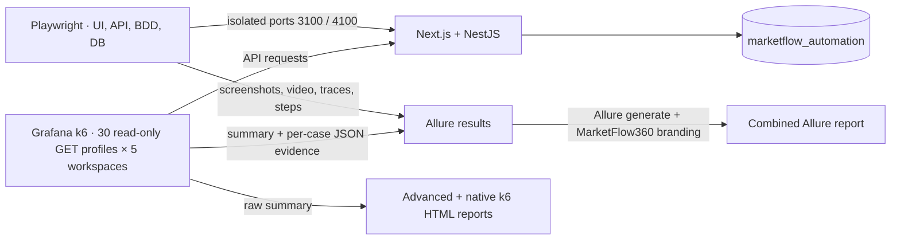

# Architecture

## Shape

This is one pnpm repository with a web app, an API app, and local service configuration. It deliberately stays as a modular monolith while the product is small: feature pages and REST controllers are separated by business area, and the database is shared through one Prisma service.

```text
Browser
  └── Next.js screens (auth/profile, overview, CRM, campaigns, content, landing pages, automations, reports, assistant)
        └── REST /api/v1 (NestJS)
              ├── Auth + workspace access guard
              ├── Feature controllers (CRM, campaigns, content, pages, automations)
              └── Prisma → PostgreSQL
```

Redis is provisioned but not yet used by the application. Failed sign-in attempts are counted in PostgreSQL so all API instances share the throttle. Immediate automations run on lead creation; delayed runs are persisted and polled every 15 seconds by an in-process worker with retry state. Task reminders are persisted in PostgreSQL and polled by a separate API worker. Run one API instance until both workers use shared queue/lease infrastructure.

## Quality automation architecture

The automation package is a development and CI toolchain, separate from the product's runtime. It exercises the web app and API against an isolated `marketflow_automation` database and five dedicated workspace fixtures. Its 750 named cases are split across 260 UI, 140 API, 100 BDD, 100 database and 150 k6 cases. The database preparer and Playwright setup reject non-test database names unless an explicit override is set.



Playwright starts the API and web app on dedicated local ports and runs its UI, API contract, Gherkin and SQL suites as separate projects. Global setup provisions an authenticated owner session and five workspaces. The k6 runner uses those workspace/session fixtures to make read-only API requests; it creates 150 named Allure cases and raw JSON summary evidence. Default thresholds are HTTP p95 below 800 ms and p99 below 1500 ms, with response-status, non-empty-body and per-request latency checks. They are configurable and represent a local baseline, not a production capacity target.

Allure stores individual steps, hooks and attachments in ignored `automation/allure-results/`. UI and BDD cases attach browser screenshots and recordings; API and database cases skip blank browser media, while failures retain traces. k6 cases attach request counts and latency percentiles. The report generator merges retry attempts into the final case count while preserving attempt details, and adds the branded overview, categories, test-detail evidence, and links to the standalone advanced and native k6 reports. Generated reports and run state live under ignored `automation/allure-report/`, `automation/performance/reports/` and `automation/.state/`. Setup, commands, screenshots and report navigation are documented in [`automation/README.md`](../automation/README.md).

## Multi-tenancy and access

- CRM records store a `workspaceId`; list/detail/edit queries use the server-verified workspace on the request.
- The browser sends `x-workspace-id` as a selection hint. The API checks the authenticated user’s direct membership before any workspace CRM route uses it.
- Agency-to-client access is explicit in `AgencyClientAccess`. Agency and client workspace owners/admins authorize the grant. Users can see a granted client only if they are also a member of that agency. A read-only agency role stays read-only when switching into a client workspace.
- A deal’s linked lead/customer and a task’s linked lead/customer are checked against the same workspace.
- The UI hides team management for read-only and granted-client users; backend checks remain authoritative.
- Pipeline stage labels/order/keys are stored per workspace. Keep the `NEW` entry stage; leads in a removed stage are moved to the first configured stage. File attachments are checked against the target workspace record before storage/download.

## Sessions and demo delivery

- Passwords use Node’s `scrypt` with an individual random salt.
- Session tokens are random values stored as SHA-256 hashes; cookies are `HttpOnly`, `SameSite=Strict`, expire after seven days, and are revoked on logout/reset.
- Signed-in profile editing updates name, phone and a bounded base64 profile image. Password changes verify the current password and revoke the user's other active sessions.
- Email verification, password reset and invitations use expiring, one-use token hashes. A Resend adapter sends mail when `RESEND_API_KEY` is configured; otherwise endpoints return a demo URL.
- Login throttling stores a hash of the email/IP key in PostgreSQL (eight failures per email/IP in a 15-minute window); raw email/IP are not saved in the throttle table.
- Published landing-page forms and keyed lead webhooks also use shared PostgreSQL request limits per IP and page/webhook, which reduces simple spam bursts but is not a CAPTCHA or a substitute for edge abuse protection.
- `NODE_ENV=production` enables the cookie `Secure` flag. A production deployment also needs TLS, configured mail, public-form abuse protection and operational monitoring.

## Data and API

- Money uses integer minor units plus an explicit currency code. Campaign budgets are planned amounts; external spend/conversion metrics are unavailable until integrations exist.
- PostgreSQL schema/migrations and seed fixtures live under `apps/api/prisma`.
- DTOs use `class-validator`; a global `ValidationPipe` transforms input, strips unknown fields and rejects non-whitelisted properties.
- REST routes are prefixed `/api/v1`; the API covers authentication, workspaces, leads, customers, deals, tasks, pipeline configuration, attachments, campaigns, content, landing pages, automations, reports and a database-derived overview.
- Attachments (PDF, PNG, JPEG, WebP, text and CSV) are limited to 3 MB and stored as PostgreSQL `BYTEA`; downloads use forced attachment disposition and MIME signature checks. There is no malware scanner. Configure private object storage for larger or production file volumes.
- A due task reminder is scheduled for 30 minutes before its due date. The database-backed worker claims due reminders, emails the task owner (or workspace owner) through Resend, and retries failures. It does not send without `RESEND_API_KEY`; use one API instance until reminders move to a dedicated queue/worker deployment.
- The workspace assistant groups common lead/task/deal/campaign questions and answers with data from only the selected workspace. It is deterministic and does not call an external model provider. Appearance preferences (theme and font stack) are stored in the browser.
- Public landing forms create workspace-scoped website leads. They do not yet have configurable consent fields, CAPTCHA or custom-domain support.
- Campaign/content state is internal; social publishing, external ad metrics, configurable landing-page form blocks beyond optional text questions, branching/workflow versioning and a shared automation queue require later adapters/workers.

## Environment

Node.js 24, Corepack/pnpm 10, Docker Compose, PostgreSQL and Redis are the local baseline. `apps/api/.env.example` documents connection values. The local API defaults to port 4000 and the web app to port 3000. See the root README for fresh setup commands.
